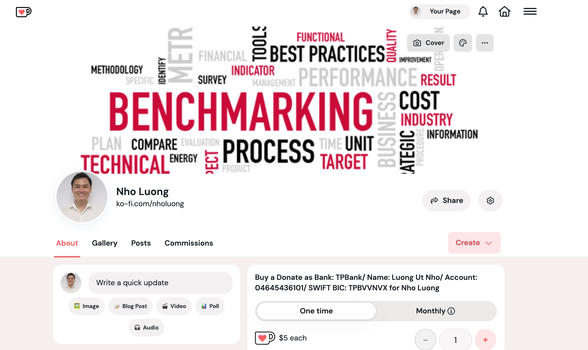

# Ansible Role - mongodb_local_replica_set


### [View all Roadmaps](https://github.com/nholuongut/all-roadmaps) &nbsp;&middot;&nbsp; [Best Practices](https://github.com/nholuongut/all-roadmaps/blob/main/public/best-practices/) &nbsp;&middot;&nbsp; [Questions](https://www.linkedin.com/in/nholuong/)
<br/>

Manage a Local MongoDB installation as a Replica Set
This project manages a local replica set instance of MongoDB. The default MongoDB installation is not a replica set. In order to take advantages of some of the features that a replica set brings, the local configuration needs to be enabled as a replica set.

## Variables

```yaml
data_path: /opt/mongodb
rs_servers:
  - { _id: 0, name: rs0_0, port: "27019" }
local_user: "{{ lookup('env','USER') }}"
home_dir: "{{ lookup('env','HOME') }}"
agents_dir: "{{ home_dir }}/Library/LaunchAgents"
config_dir: "/usr/local/etc"
```

## Examples

```yaml
- hosts: all
  gather_facts: inventory_hostname != 'localhost'
  roles:
    - nholuong.mongodb_local_replica_set
```

## Linting

```bash
yamllint -c yamllint.yaml .
ansible-lint .
```

# 🚀 I'm are always open to your feedback.  Please contact as bellow information:
### [Contact ]
* [Name: nho Luong]
* [Skype](luongutnho_skype)
* [Github](https://github.com/nholuongut/)
* [Linkedin](https://www.linkedin.com/in/nholuong/)
* [Email Address](luongutnho@hotmail.com)



[](https://ko-fi.com/nholuong)

# License
* Nho Luong (c). All Rights Reserved.🌟
